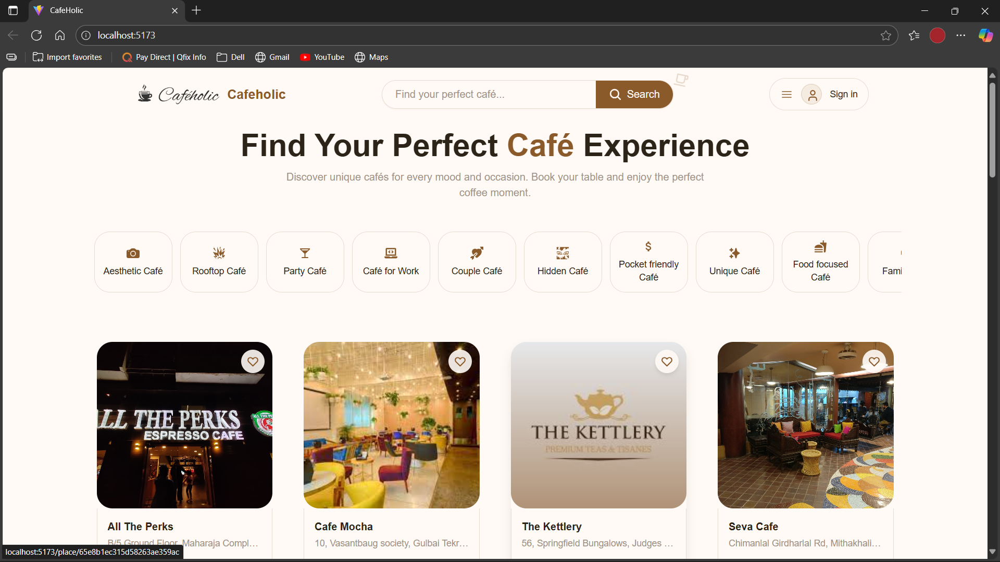
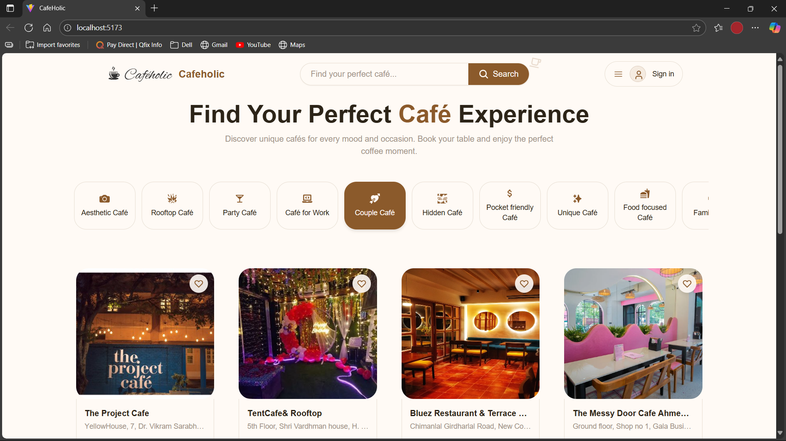
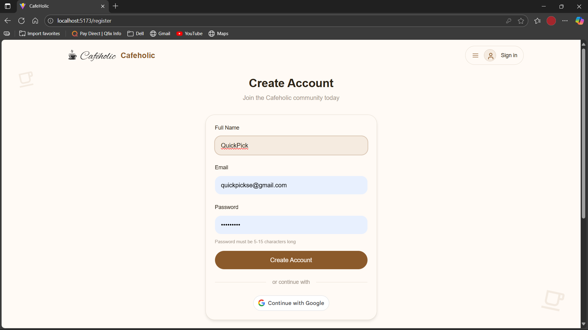
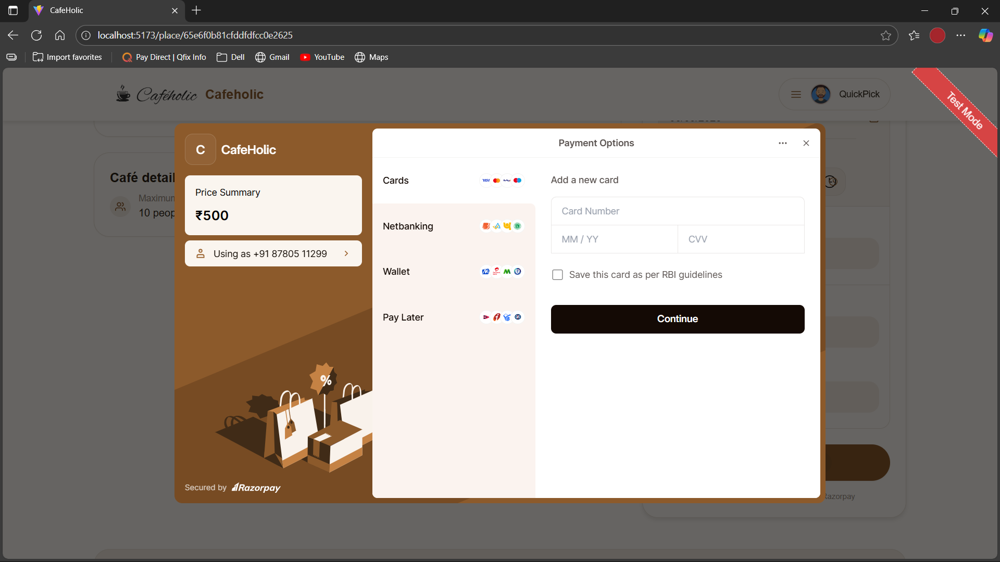
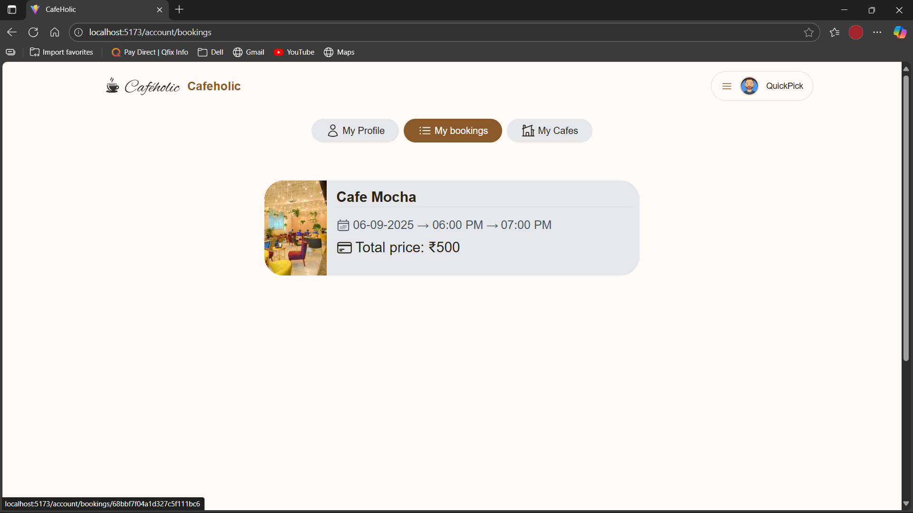
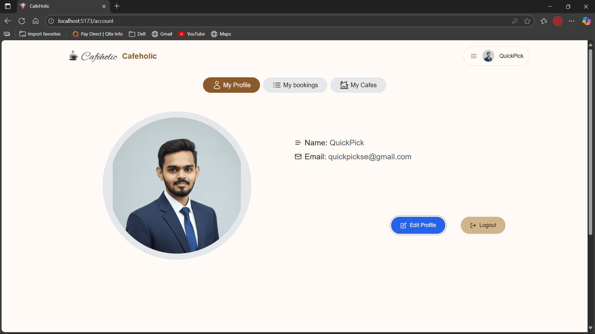

# Caféholic  

Caféholic is a full-stack web platform that allows users to discover cafés, browse menus, and book tables online. It features three different roles:  

- **Admin**: Manage users, cafés, categories, and bookings.  
- **Café Owner**: Add/manage cafés, view and manage customer bookings.  
- **User**: Browse/search cafés, view details, and book tables with secure payment via Razorpay.  

Built with **MERN Stack**, integrated with **Cloudinary** for image storage and **Razorpay** for payments.  

---

## 🚀 Tech Stack  

- **Frontend**: React.js (Vite), TailwindCSS, Axios  
- **Backend**: Node.js, Express.js  
- **Database**: MongoDB  
- **Authentication**: JWT, Google OAuth  
- **Cloud Storage**: Cloudinary  
- **Payments**: Razorpay  

---

## ⚙️ Project Setup  

### 1. Clone the Repository  
```bash
git clone https://github.com/Virag-Koradiya/cafeholic.git
cd cafeholic
```

### 2. Backend Setup (API)  
```bash
cd api
npm install
npm start
```

### 3. Frontend Setup (Client)  
```bash
cd client
npm install
npm run dev
```

---

## 🛠️ Environment Variables

### Client (client/.env)
```bash
VITE_BASE_URL=
VITE_GOOGLE_CLIENT_ID=
REACT_APP_RAZORPAY_KEY_ID=
```

### API (api/.env)
```bash
DB_URL=
PORT=
JWT_SECRET=
JWT_EXPIRY=
COOKIE_TIME=
SESSION_SECRET=
CLOUDINARY_NAME=
CLOUDINARY_API_KEY=
CLOUDINARY_API_SECRET=
CLOUDINARY_URL=
CLIENT_URL=
RAZORPAY_KEY_ID=
RAZORPAY_KEY_SECRET=
```

---

## Snapshots

### Home Page


### Category


### Cafe Description


### Register user


### Table Booking


### View my bookings


### User profile management


### Add new cafe request


### Admin view and manage cafe requests


### Admin view all bookings


### Admin view all users

